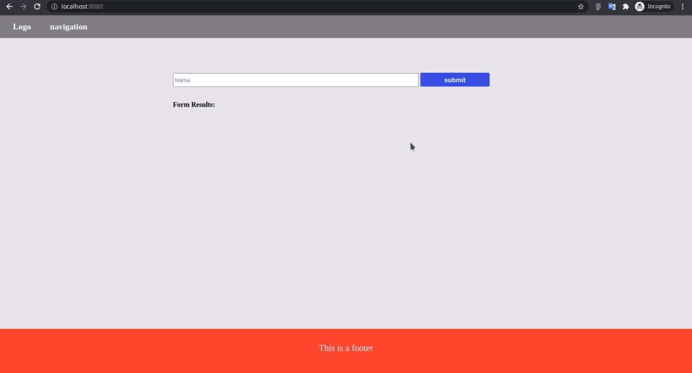

# Evaluate a news article with Natural Language Processing
This project can fetch articles on the internet using MeaningCloud api that uses NLP

> Natural language processing (NLP) is a subfield of computer science, information engineering, and artificial intelligence
concerned with the interactions between computers and human (natural) languages, in particular how to program computers to
process and analyze large amounts of natural language data.

## Installation

* Download or Run git clone https://github.com/Ahmed7fathi/fwd-evaluate-news-nlp.git to clone this repository.
* Install project dependencies  
 `npm install`
* create `.env` file in the repo root directory and add `API_KEY=<YOUR_KEY>`
* start ExpressJs server
`npm start ` can be seen at : http://localhost:8081
* Start the development server  
 `npm run build-dev` can be seen at : http://localhost:8081

## Production
you can let webpack generate production files by running
`npm run build-prod`
dist folder will be found in repo root directory